<div align="center">

# Krausen — Frontend

**Plataforma de recetas de cerveza artesanal**

[](https://nextjs.org)
[](https://typescriptlang.org)
[](https://tailwindcss.com)

</div>

---

## ¿Qué es Krausen?

Krausen es una plataforma de recetas de cerveza artesanal donde los usuarios pueden publicar elaboraciones, hacer versiones (forks) de recetas existentes, registrar temperaturas de fermentación y valorar las recetas de la comunidad. Este repositorio contiene el frontend — construido con Next.js 15 y App Router.

🍺 **Backend:** [github.com/ArocaDev/krausen-backend](https://github.com/ArocaDev/krausen-backend)

---

## ✨ Funcionalidades

- **Explorar recetas** con búsqueda por nombre y filtros avanzados (ingrediente, autor, estilo, alcohol, IBU)
- **Detalle de receta** con ingredientes, pasos de elaboración, gráfica de fermentación y comentarios
- **Sistema de forks** — árbol de versiones interactivo con SVG y controles de zoom
- **Crear receta** con formulario completo: imagen, estilo, ingredientes, pasos y configuración de fermentación
- **Registro de temperaturas** de fermentación con gráfica Recharts
- **Ranking** mensual, anual y global por me gustas
- **Notificaciones** en tiempo real (me gustas y forks)
- **Perfil público** de cada usuario con sus recetas y me gustas recibidos
- **i18n** — Español, Inglés y Alemán con `next-intl`
- **Auth completo** — login, registro, recuperación de contraseña, refresh token automático

---

## 📸 Capturas

<div align="center">

| Landing | Login | Registro |
|:-:|:-:|:-:|
| 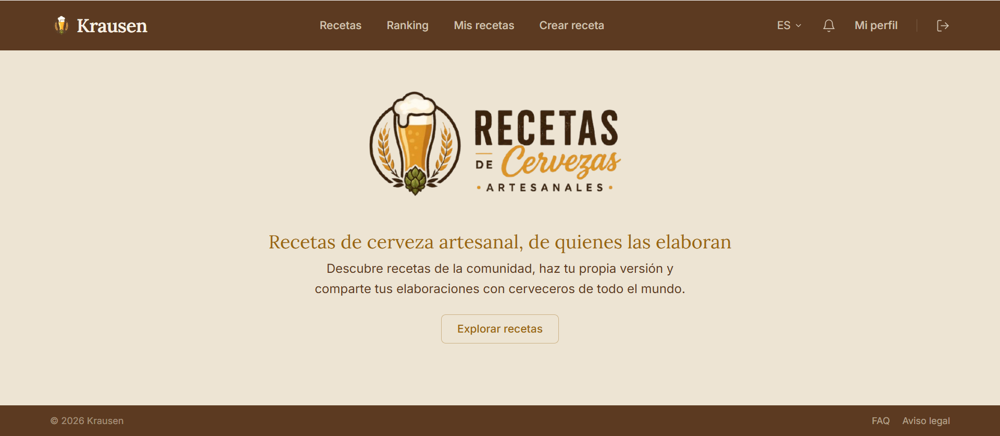 | 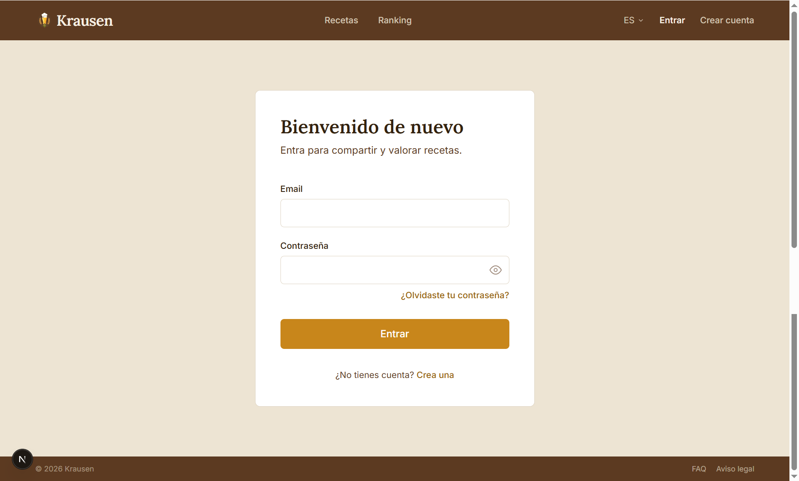 | 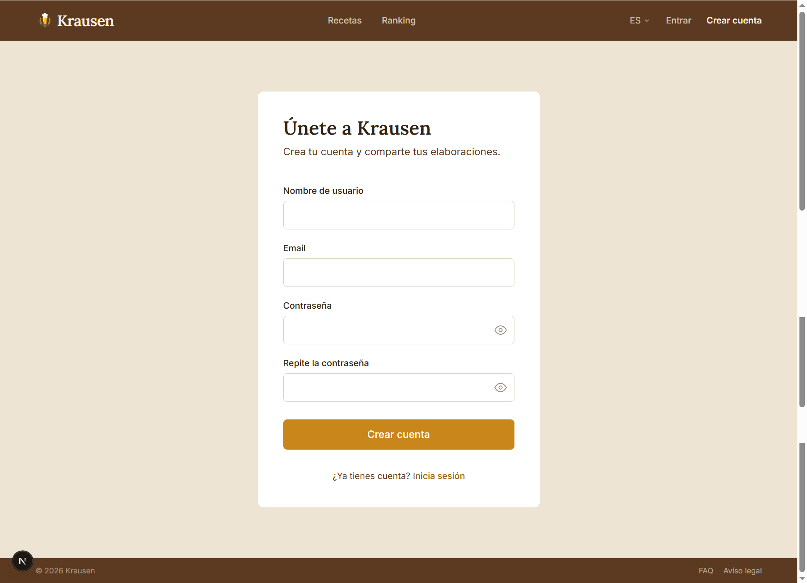 |

| Explorar recetas | Detalle de receta | Fermentación |
|:-:|:-:|:-:|
| 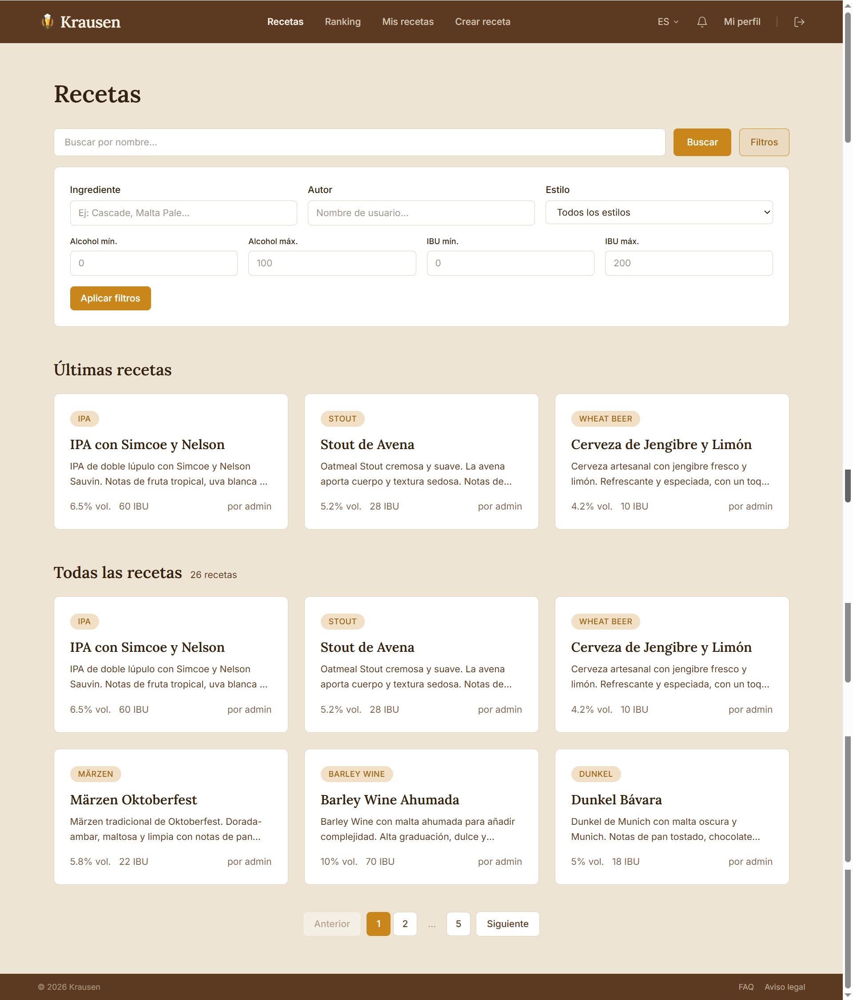 | 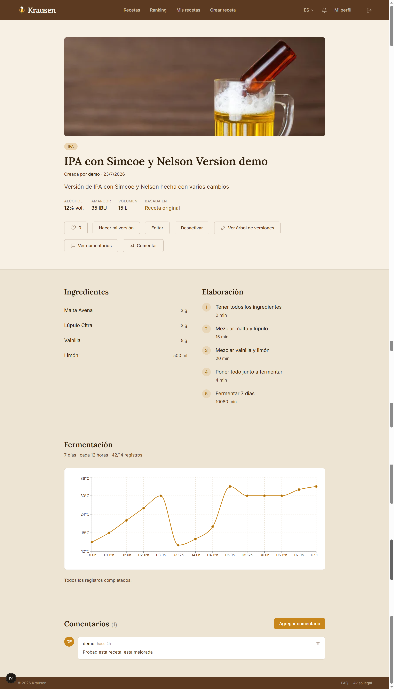 | 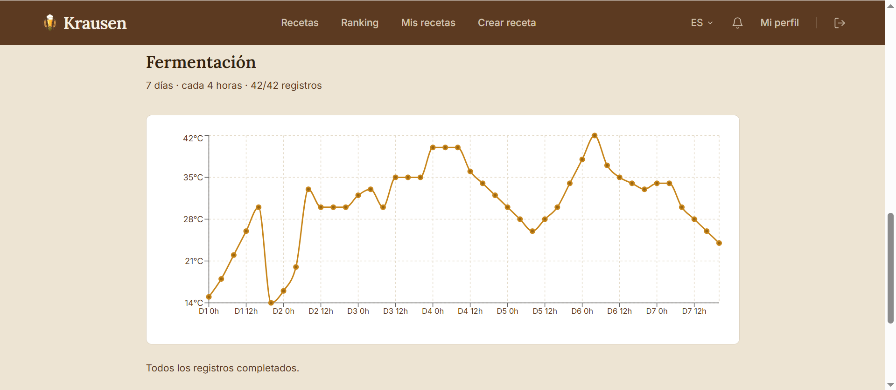 |

| Árbol de versiones | Ranking | Notificaciones |
|:-:|:-:|:-:|
| 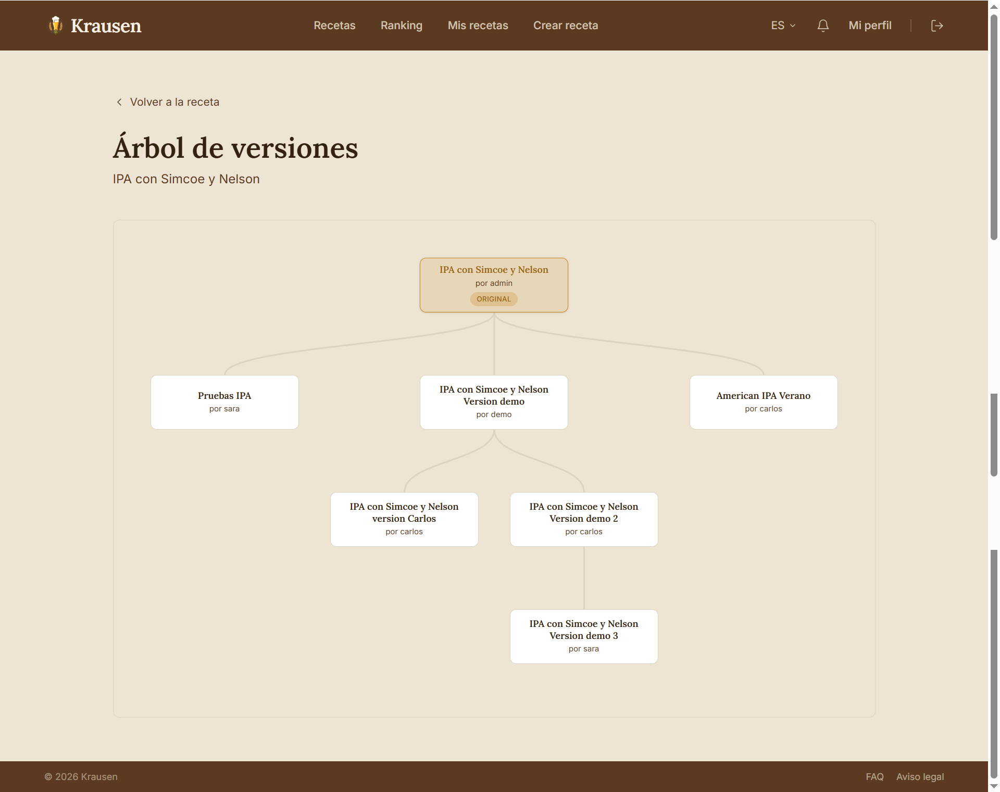 | 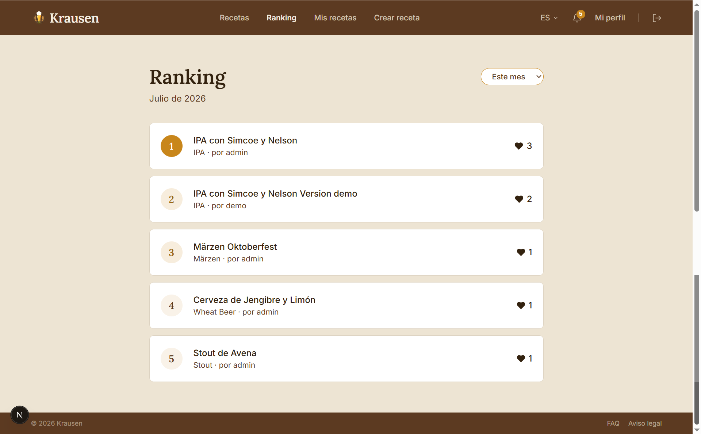 | 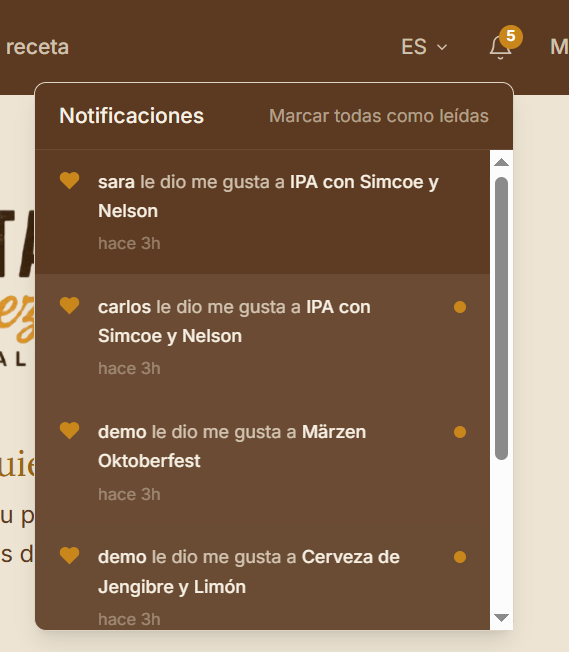 |

| Nueva receta | Mis recetas | Perfil propio | Perfil público |
|:-:|:-:|:-:|:-:|
| 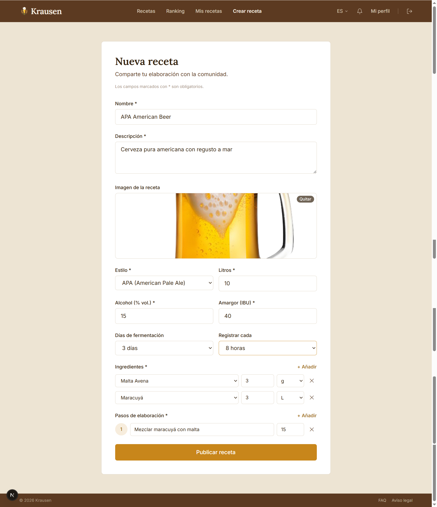 | 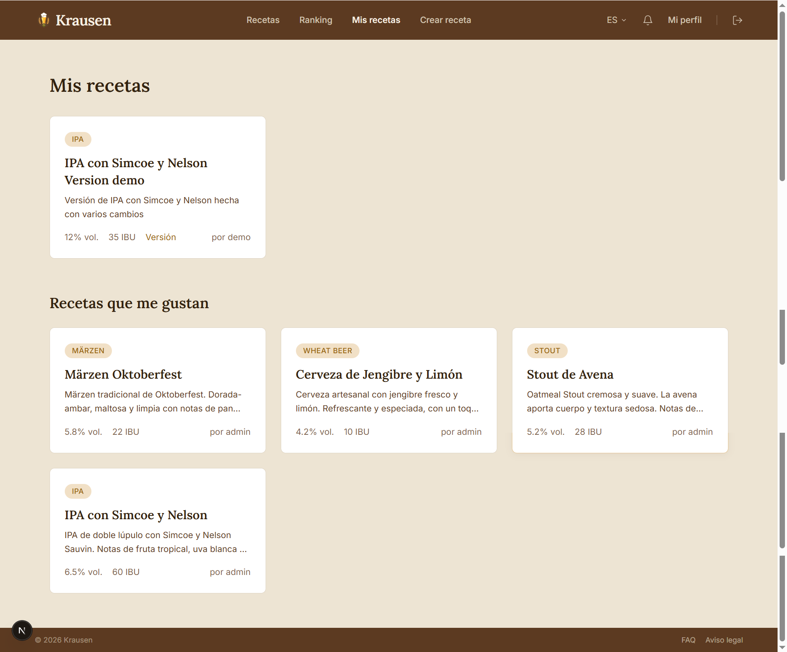 | 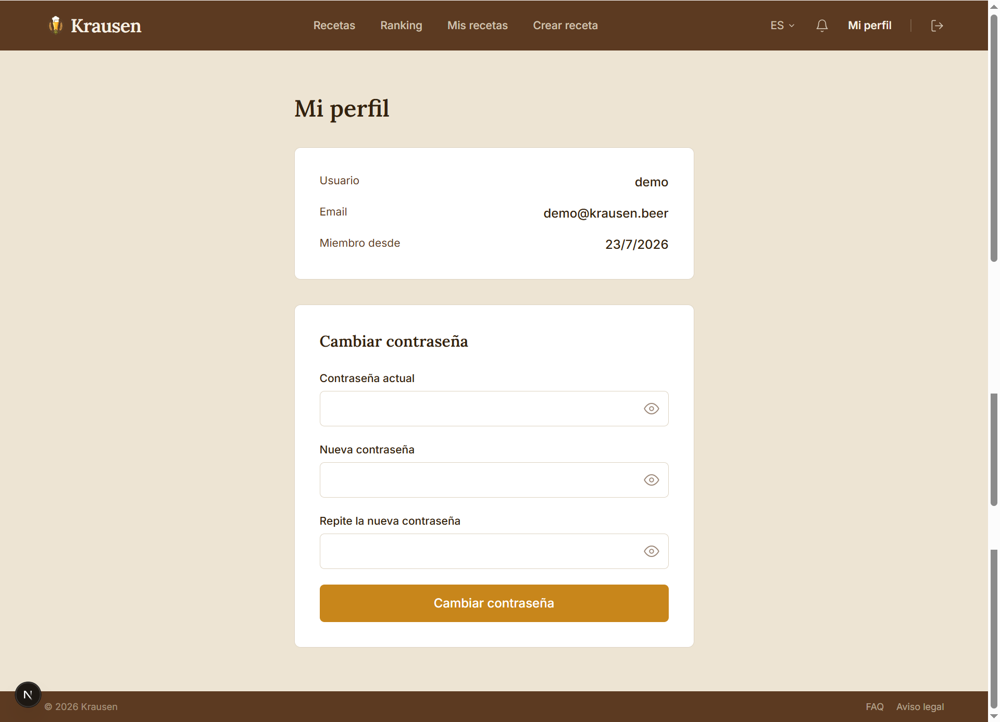 | 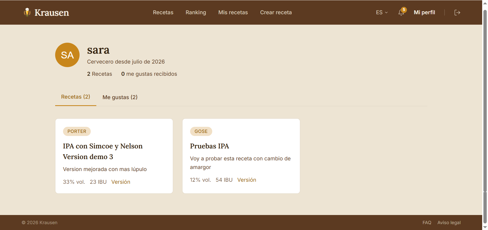 |

</div>

---

## 🎬 Demo

**Explorar y filtrar recetas**

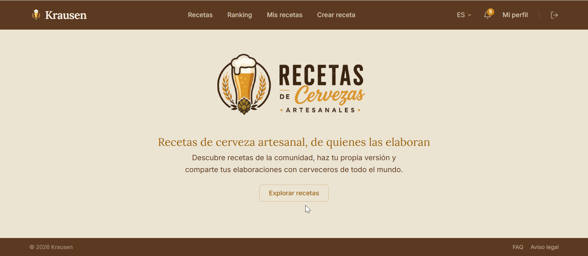

**Ranking, notificaciones e idiomas**

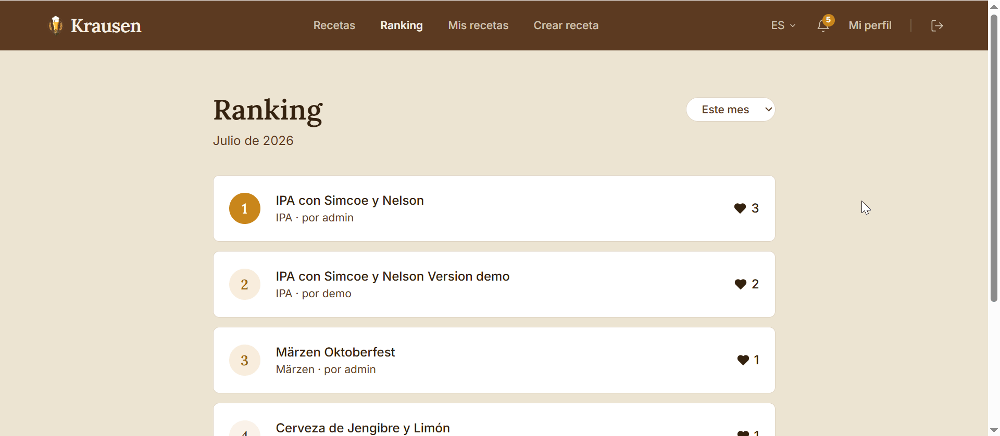

**Crear una receta**

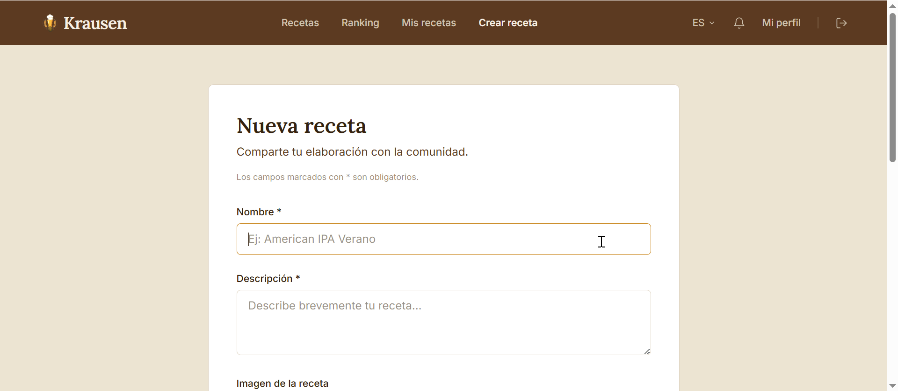

**Detalle de receta y fermentación**

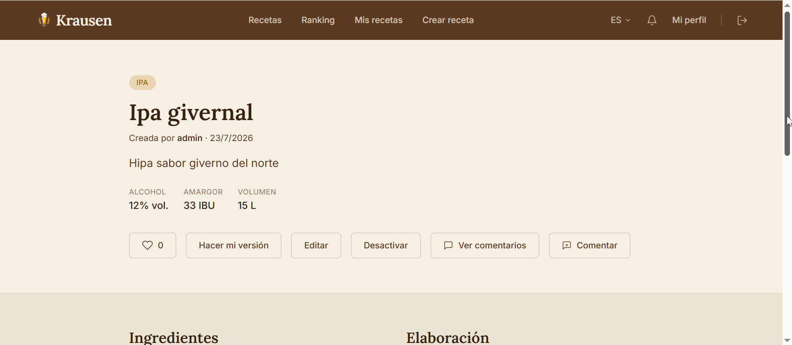

**Fork y árbol de versiones**

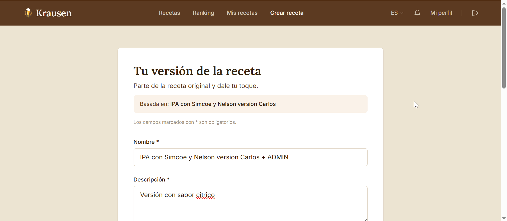

---

## 🛠️ Stack técnico

| Capa | Tecnología |
|------|-----------|
| Framework | Next.js 15 + App Router |
| Lenguaje | TypeScript 5 |
| Estilos | Tailwind CSS 3 |
| i18n | next-intl (ES / EN / DE) |
| Gráficas | Recharts |
| HTTP | Axios |
| Fuentes | Lora (serif) + Inter |

---

## 📁 Estructura del proyecto

```
krausen-frontend/
├── app/
│   └── [locale]/
│       ├── cervezas/
│       │   ├── [id]/
│       │   │   ├── page.tsx         # Detalle de receta
│       │   │   ├── arbol/page.tsx   # Árbol de versiones
│       │   │   └── fermentacion/page.tsx
│       │   └── nueva/page.tsx       # Crear receta
│       ├── ranking/page.tsx
│       ├── mis-recetas/page.tsx
│       ├── perfil/page.tsx
│       ├── usuarios/[username]/page.tsx
│       ├── login/page.tsx
│       └── registro/page.tsx
├── components/
│   ├── ArbolForks.tsx
│   ├── GraficaFermentacion.tsx
│   ├── Notificaciones.tsx
│   ├── Skeleton.tsx
│   └── Toast.tsx
├── lib/
│   └── api.ts
├── messages/
│   ├── es.json
│   ├── en.json
│   └── de.json
├── assets/
│   └── .gitkeep
└── public/
```

---

## 🚀 Instalación

```bash
git clone https://github.com/ArocaDev/krausen-frontend.git
cd krausen-frontend
npm install
cp .env.local.example .env.local
# Edita .env.local con la URL del backend
npm run dev
```

Accede en `http://localhost:3000`

---

## 🔑 Variables de entorno

```env
NEXT_PUBLIC_API_URL=http://localhost:8000
```

---

## 🗺️ Roadmap

- [x] Explorar recetas con filtros avanzados
- [x] Detalle de receta con ingredientes y pasos
- [x] Sistema de forks con árbol SVG interactivo
- [x] Zoom en árbol de versiones
- [x] Registro y gráfica de temperaturas de fermentación
- [x] Me gustas y ranking mensual/anual/global
- [x] Notificaciones
- [x] Comentarios
- [x] Perfil público y propio
- [x] i18n ES/EN/DE con next-intl
- [x] Skeleton loaders en todas las páginas
- [x] Toast system reutilizable
- [x] Refresh token automático
- [ ] Despliegue en Vercel
- [ ] Demo en vídeo

---

## 👤 Autor

**Alejandro Rodríguez Calabuig**  
[github.com/ArocaDev](https://github.com/ArocaDev) · [LinkedIn](https://www.linkedin.com/in/alejandro-rodriguez-calabuig-a871a1230)

---

## 📄 Licencia

Proyecto personal — no licenciado para uso comercial.
